# ProyectoFinalV-VG4
### Integrantes:
- Keler Modesto Calixto
- Angelo Villar Arias
- Francesco Abad
- Luis Sifuentes
- Diego D.
# PetClinic Automation Testing Project

## Propósito del Proyecto

El propósito de este proyecto es realizar pruebas automatizadas sobre el sistema **PetClinic** utilizando una combinación de herramientas de pruebas y análisis, como **JUnit**, **Selenium**, **SonarQube**, **JMeter**, **OWASP ZAP** y **Jenkins**. Este proyecto tiene como objetivo asegurar la calidad del código y verificar el correcto funcionamiento de las funcionalidades del sistema PetClinic a través de pruebas de seguridad, rendimiento, funcionalidad y análisis estático.

---
## Objetivos

El objetivo de este proyecto es implementar un pipeline de integración continua y entrega continua (CI/CD) que permita realizar las siguientes actividades:
- Análisis estático del código con **SonarQube**.
- Realizar pruebas unitarias con **JUnit** para verificar el funcionamiento correcto de las funcionalidades.
- Realizar pruebas funcionales con **Selenium** para asegurar que las funcionalidades del sistema trabajen según lo esperado.
- Ejecutar pruebas de seguridad usando herramientas como **OWASP ZAP**.
- Ejecutar pruebas de rendimiento utilizando **JMeter**.
- Integrar todo el flujo de pruebas y análisis en un **pipeline de Jenkins**.


---

## Funcionalidades Principales
- **Agregar Dueño**

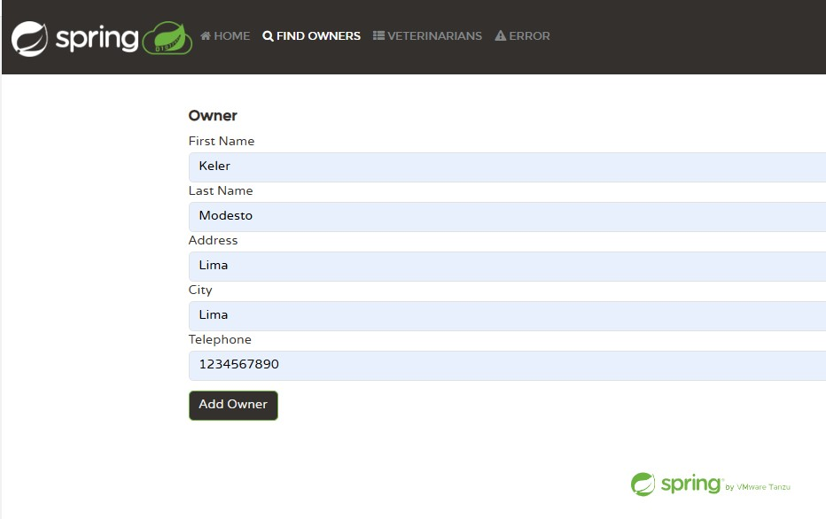
- **Agregar Mascota**

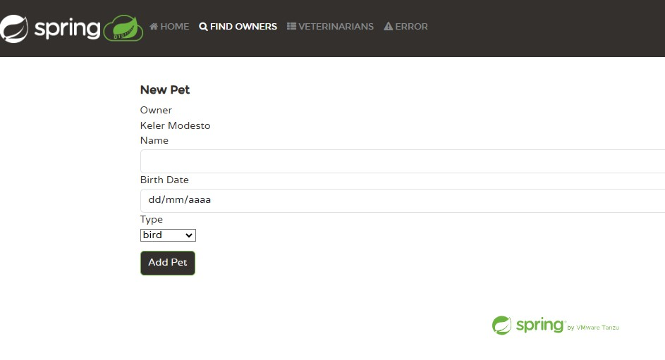
- **Encontrar dueño**

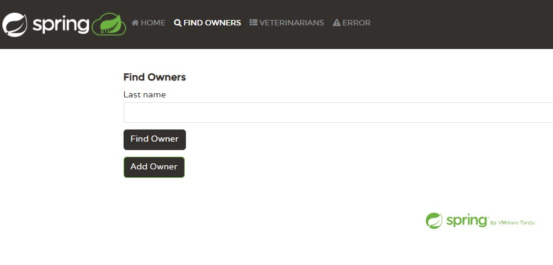
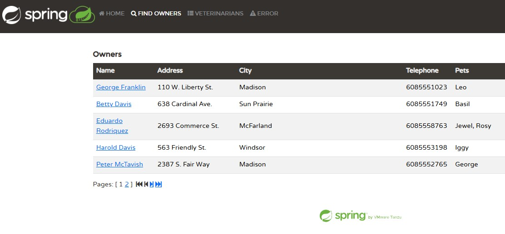
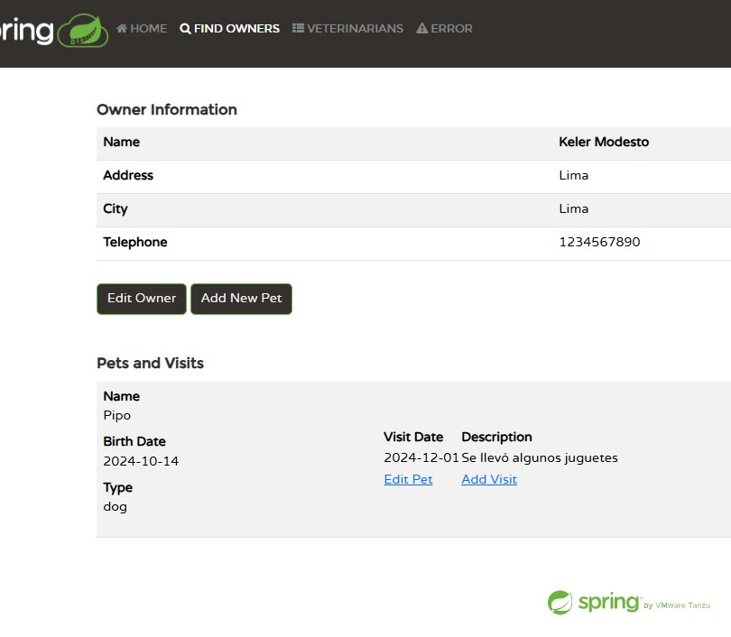
- **Agregar Visita**

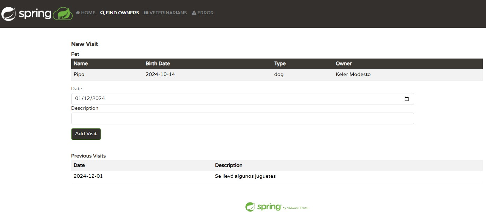
- **Actualizar los datos de la mascota**

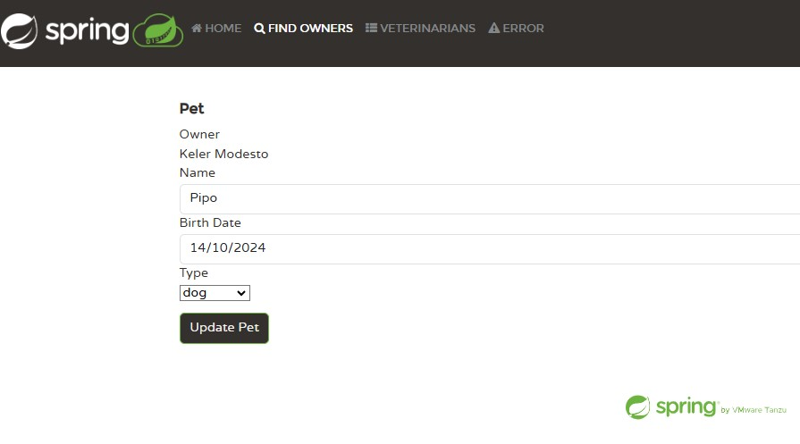
- **Buscador de veterinarios**

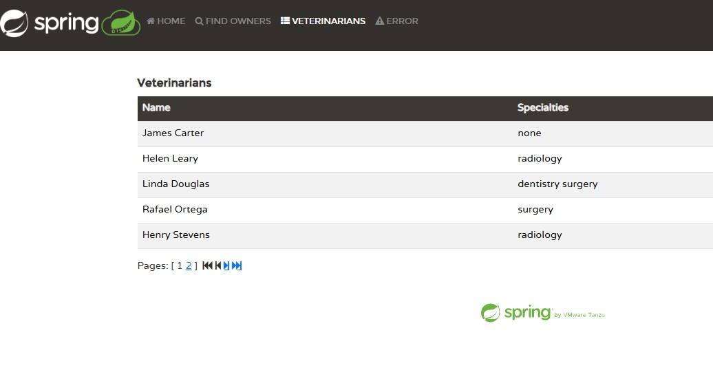

---
## Pipeline

### Herramientas/Frameworks

- **SonarQube**: Realiza el análisis estático del código para detectar problemas como errores, vulnerabilidades y malos hábitos en el código.
  - **Evidencia**:
    - La integración con **Jenkins** se realiza configurando el análisis de SonarQube en el archivo `Jenkinsfile`, como una etapa que se ejecuta después de las pruebas unitarias.
    ```bash
        stage("SonarQube Analysis") {
            steps {
                //echo "SonarQube Analysis skipped"
                
                bat "$SCANNER_HOME/bin/sonar-scanner -Dsonar.url=http://localhost:9000/ \
                    -Dsonar.login=squ_f98ffa7978805dd40117bf4113272c66f6164f59 \
                    -Dsonar.projectKey=ProyectoFinal \
                    -Dsonar.projectName=ProyectoFinal \
                    -Dsonar.sources=spring-petclinic-main/src/main/java \
                    -Dsonar.java.binaries=."
                
            }
        }
    ```

- **JUnit**: Utilizado para las pruebas unitarias.
  
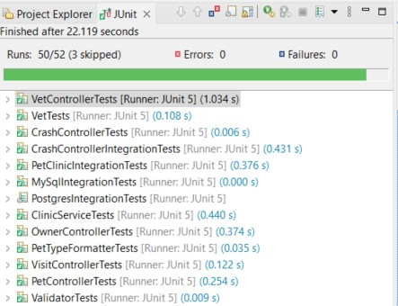
  - **Evidencia**:
    ```java
    class VetTests {
        @Test
        void testSerialization() {
            Vet vet = new Vet();
            vet.setFirstName("Zaphod");
            vet.setLastName("Beeblebrox");
            vet.setId(123);
            @SuppressWarnings("deprecation")
            Vet other = (Vet) SerializationUtilFs.deserialize(SerializationUtils.serialize(vet));
            assertThat(other.getFirstName()).isEqualTo(vet.getFirstName());
            assertThat(other.getLastName()).isEqualTo(vet.getLastName());
            assertThat(other.getId()).isEqualTo(vet.getId());
        }
    }
    ```

  - **Integración con Jenkins**
    ```java
        stage("Run Unit Tests") {
        steps {
            //echo "Unit Tests skipped"
            bat "mvn -f spring-petclinic-main test -Dcheckstyle.skip=true"
        }
    }
    ```

- **Selenium**: Usado para pruebas funcionales de la interfaz de usuario.
  - **Evidencia (fragmento de código)**:
    ```java
	// Test para crear un dueño
	@Test
	void testCreateOwnerValid() {
		try {
			driver.get("http://localhost:9090/owners/new");

			WebElement firstName = driver.findElement(By.name("firstName"));
			WebElement lastName = driver.findElement(By.name("lastName"));
			WebElement address = driver.findElement(By.name("address"));
			WebElement city = driver.findElement(By.name("city"));
			WebElement telephone = driver.findElement(By.name("telephone"));

			firstName.sendKeys("John");
			lastName.sendKeys("Doe");
			address.sendKeys("123 Elm Street");
			city.sendKeys("Springfield");
			telephone.sendKeys("1234567890");

			WebElement submitButton = driver.findElement(By.cssSelector("button[type='submit']"));
			submitButton.click();

			// Verificar que el dueño fue creado
			assertTrue(driver.getPageSource().contains("New Owner Created"));
		} catch (Exception e) {
			System.err.println("Error during 'Create Owner' test: " + e.getMessage());
			throw e; // Rethrow to fail the test
		}
	}
    ```

  - **Integración con Jenkins**: Las pruebas de Selenium se ejecutan dentro del pipeline de Jenkins, utilizando el comando `mvn -f SeleniumDemo test` para las pruebas funcionales.
    ```Java
        stage("Selenium Test") {
            steps {
                //echo "Selenium skipped"
                bat "mvn -f SeleniumDemo test"
            }
        }
    ```

- **JMeter**: Usado para realizar pruebas de rendimiento.
  - **Evidencia**: Las pruebas de carga son ejecutadas en el pipeline de Jenkins a través de un archivo de configuración de **JMeter**.
    ```bash
		stage("Performance Testing with JMeter") {
			steps {
			    //echo "JMeter skipped"
			    
				dir('spring-petclinic-main/src/test/jmeter') {
					bat 'jmeter -n -t petclinic_test_plan.jmx -l results.jtl'
					bat 'jmeter -g results.jtl -o ./report/'
				}
				
			}
		}
    ```

- **OWASP ZAP**: Se usa para realizar pruebas de seguridad en la aplicación.
  - **Evidencia**:
    - Las pruebas de seguridad son ejecutadas como parte del proceso de integración continua en Jenkins, usando el plugin de **OWASP ZAP** o herramientas de línea de comando.
    ```bash
		stage("ZAP Auto-Scan") {
		    steps {
		        //echo "ZAP skipped"
				bat "java -Xmx512m -jar \"${ZAP_PATH}\" -cmd -quickurl ${TARGET_URL} -quickout ./zap.html"
		    }
		}
    ```
---

## Construcción Automática

La construcción automática del proyecto se realiza utilizando **Maven**. Se configura un pipeline en Jenkins que realiza las siguientes acciones:

1. **Compilación y construcción del código**: Se realiza con Maven.
2. **Pruebas unitarias y de integración**: Ejecutadas con JUnit.
3. **Análisis estático con SonarQube**: Se analiza el código con SonarQube.
4. **Ejecución de pruebas de rendimiento con JMeter**: Se realizan las pruebas de rendimiento.
5. **Pruebas funcionales**: Implementadas con Selenium.
6. **Ejecución de pruebas de seguridad con OWASP ZAP**: Se ejecutan análisis de seguridad.
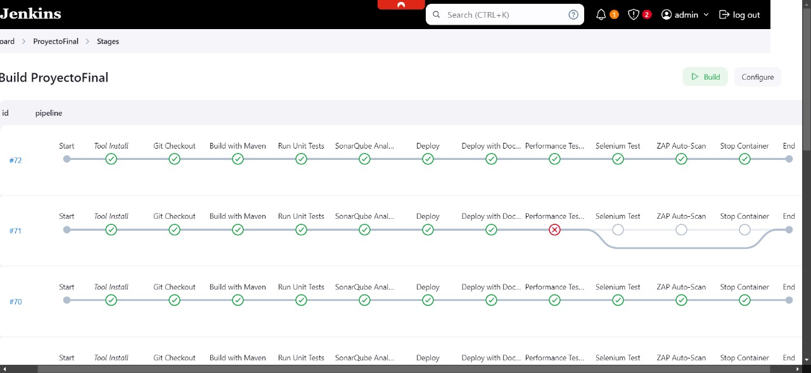

---
## Gestión de Issues
### Registro de defectos
[Descargar el Informe de Pruebas de PetClinic (PDF)](Documentacion/Informes/Issues.pdf)
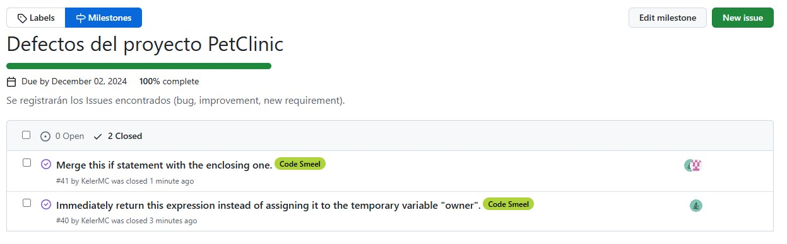
### Modificaciones para mantenibilidad y consistencia basados en el análisis de SonarQube

owner/Owner.java : Nested code

```java
	public Pet getPet(String name, boolean ignoreNew) {
        for (Pet pet : getPets()) {
            String compName = pet.getName();
            if (compName != null && compName.equalsIgnoreCase(name)) {
                if (!ignoreNew || !pet.isNew()) {
                    return pet;
                }
            }
        }
        return null;
    }
```

Solución : Merge

```java
	public Pet getPet(String name, boolean ignoreNew) {
        for (Pet pet : getPets()) {
            String compName = pet.getName();
            if (compName != null && compName.equalsIgnoreCase(name) && (!ignoreNew || !pet.isNew())) {
                return pet;
            }
        }
        return null;
    }
```

owner:PetController.java : Declaring a variable only to immediately return or throw it is considered a bad practice because it adds unnecessary complexity to the code

```java
	public Owner findOwner(@PathVariable("ownerId") int ownerId) {
        Optional<Owner> optionalOwner = this.owners.findById(ownerId);
        Owner owner = optionalOwner.orElseThrow(() -> new IllegalArgumentException(
                "Owner not found with id: " + ownerId + ". Please ensure the ID is correct "));
        return owner;
    }
```

Solución: Retornar inmedaitamente

```java
	public Owner findOwner(@PathVariable("ownerId") int ownerId) {
		Optional<Owner> optionalOwner = this.owners.findById(ownerId);
		return optionalOwner.orElseThrow(() -> new IllegalArgumentException(
				"Owner not found with id: " + ownerId + ". Please ensure the ID is correct "));
	}
```
---
## GitHub Projects
En **GitHub Projects**, se ha creado un proyecto con las siguientes tareas divididas entre los miembros del equipo:
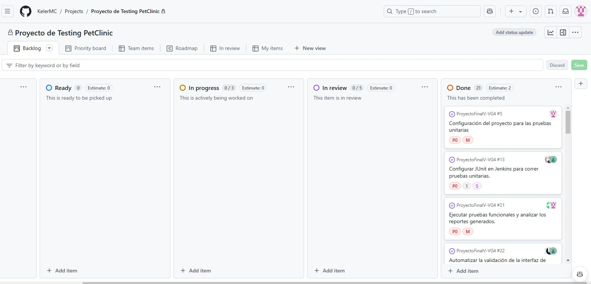
